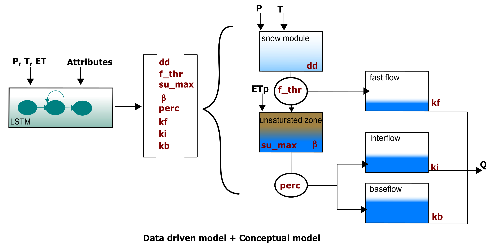

# Hy<sup>2</sup>DL: Hybrid Hydrological modeling using Deep Learning methods

[](https://zenodo.org/badge/latestdoi/684006081)



Hy<sup>2</sup>DL is a python library to create Hybrid Hydrological Models for rainfall-runoff prediction, by combining DL methods with process based models. Specifically, the DL methods act as dynamic parameterizations for process-based conceptual models.

The idea of the repository is to have 'easy' to understand codes and to introduce new users to hybrid models. Because of this, we decided to sacrifice some code modularity to gain interpretability. The main codes are presented as jupyter notebooks.

## Structure of the repository:

- **data**: Information necessary to run the codes (refer to https://doi.org/10.5281/zenodo.8289409)
- **ERA5_Land_Processing**: Script to preprocess the ERA5-Land data if one wants to extract basin-wise soil moisture information. The original scripts were taken from Less (https://github.com/tommylees112/neuralhydrology/blob/pixel/notebooks/05b_preprocess_era5.ipynb), and slightly modified to fit our purposes.
- **Model_Conceptual**: Present the codes to calibrate basin-wise process-based hydrological models using three different methods: gradient descent (gd), Differential Evolution Adaptive Metropolis (dream) and Shuffled Complex Evolution (sce). For the last 2 calibration methods, we used the SPOTPY libraty (https://spotpy.readthedocs.io/en/latest/). The process-based models are used as baselines to compare the performance of the hybrid models.
- **Model_DataDriven**: Present the codes to create a Regional rainfall-runoff models using a LSTM network. The data-driven model is used as a baseline to compare the performance of the hybrid models. 
- **Model_Hybrid**: Present the codes to create a Regional rainfall-runoff model by combining data-driven techniques with process-based hydrological models. In this case the data-driven method is used as a dynamic parameterization of the process-based models.
- **results**: Folder where the results generated by all the codes will be stored.

## Dependencies
The packages used to run the codes are indicated at the beginning of each notebook. It must be considered that the codes for the data-driven and hybrid models are created to run in GPU, therefore a PyTorch version that supports GPU should be installed! For the optimization of the conceptual models using gradient descent, the standard version (CPU) of PyTorch is enough.

## Citation:
In case you use Hy<sup>2</sup>DL, please cite our work as follows:

```
Eduardo Acuna Espinoza, Ralf Loritz, & Manuel Álvarez Chaves. (2023). KIT-HYD/Hy2DL: Preview release for submission (v0.1). Zenodo. https://doi.org/10.5281/zenodo.8289021
```

## Authors:
 - Eduardo Acuña Espinoza (eduardo.espinoza@kit.edu)
 - Ralf Loritz (ralf.loritz@kit.edu)
 - Manuel Álvarez Cháves (manuel.alvarez-chaves@simtech.uni-stuttgart.de)

 ## Disclaimer:
 No warranty is expressed or implied regarding the usefulness or completeness of the information and documentation provided. References to commercial products do not imply endorsement by the Authors. The concepts, materials, and methods used in the algorithms and described in the documentation are for informational purposes only. The Authors has made substantial effort to ensure the accuracy of the algorithms and the documentation, but the Authors shall not be held liable, nor his employer or funding sponsors, for calculations and/or decisions made on the basis of application of the scripts and documentation. The information is provided "as is" and anyone who chooses to use the information is responsible for her or his own choices as to what to do with the data. The individual is responsible for the results that follow from their decisions.

This web site contains external links to other, external web sites and information provided by third parties. There may be technical inaccuracies, typographical or other errors, programming bugs or computer viruses contained within the web site or its contents. Users may use the information and links at their own risk. The Authors of this web site excludes all warranties whether express, implied, statutory or otherwise, relating in any way to this web site or use of this web site; and liability (including for negligence) to users in respect of any loss or damage (including special, indirect or consequential loss or damage such as loss of revenue, unavailability of systems or loss of data) arising from or in connection with any use of the information on or access through this web site for any reason whatsoever (including negligence).
